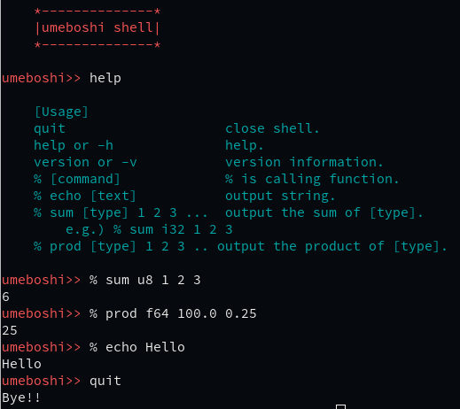

# Umeboshi

Umeboshi is japanese apricot pickles. I like :)

This application is my interactive shell.

However, this application has just started to develop, 
and does not have any particular functions.

Now, umeboshi has 6 commands.

- echo
- quit
- help
- version
- sum
- prod

## Example

    $ cargo run

