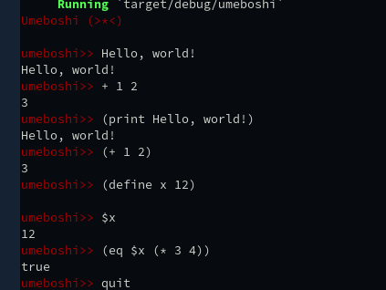

# Umeboshi

Umeboshi is japanese apricot pickles. I like :)

This application is a small language by using Reverse Polish Notation.

However, umeboshi is still under development :)

## Usage

    $ cargo run

    umeboshi>> Hello world!
    Hello world!
    umeboshi>> 1 2 +
    3
    umeboshi>> 1 2 + 3 ==
    true
    umeboshi>> 12 x bind

    umeboshi>> 18 $x +
    30

## Screenshot

