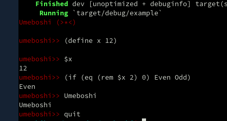

# Umeboshi

Umeboshi is japanese apricot pickles. I like :)

This application is something like Common Lisp REPL.

However, umeboshi is still under developing :)

## Usage

    $ cargo run

    umeboshi>> Hello world!
    Hello world!
    umeboshi>> (print Hello, world!)
    Hello, world!
    umeboshi>> (+ 1 2)
    3
    umeboshi>> (eq 4 (* 2 2))
    true
    umeboshi>> (define x 12)

    umeboshi>> (+ $x 18)
    30

## Screenshot

